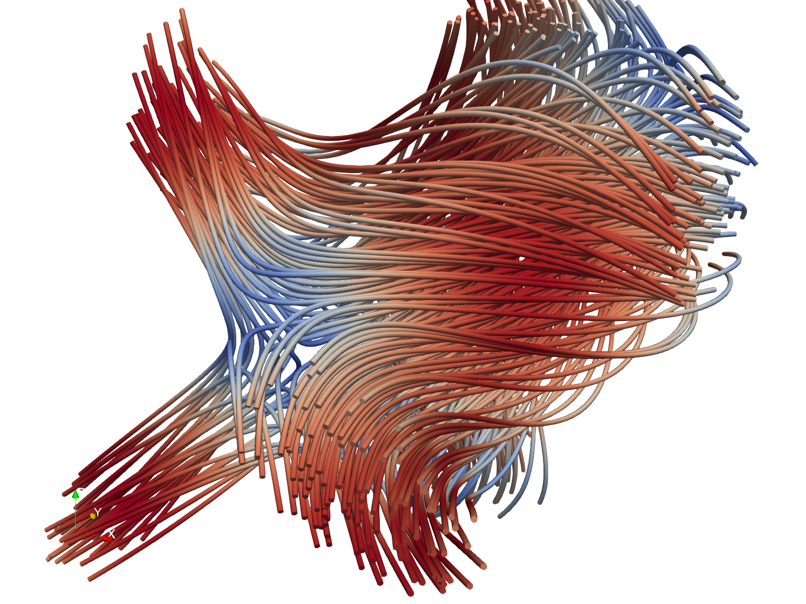

# Scientific Visualization with ParaView — Synthetic 3D Field

A self-directed scientific-visualization project: generate a 3D scientific
dataset with NumPy, then build and script the visualization pipeline in
**ParaView** via its Python API (`paraview.simple`).

> **Honest framing:** this is a personal learning/portfolio project, not paid
> or professional work. It demonstrates hands-on ParaView and VTK skill on a
> synthetic-but-physically-motivated dataset.

## Gallery

| Volume rendering (concentration field) | Streamlines (ABC-flow velocity) |
|---|---|
|  |  |


## What it shows

The dataset lives on a 64×64×64 regular grid and carries two fields:

| Field | Type | Physics analog | Visualized with |
|---|---|---|---|
| `concentration` | scalar | sum of 3D Gaussian sources (diffusion/transport) | volume rendering, isosurfaces, slicing |
| `velocity` | vector | ABC flow (Arnold–Beltrami–Childress analytic flow) | streamlines (Stream Tracer) + tubes |

## ParaView / VTK techniques demonstrated
- **Volume rendering** of a scalar field with a transfer function (Viridis preset)
- **Isosurfaces** via the Contour filter at multiple levels
- **Slicing** with an axis-aligned cut plane
- **Streamlines** via Stream Tracer over a vector field, rendered as Tubes and colored by speed
- **Colormaps / transfer functions** and clean figure export
- **Full pipeline automation** in Python (`paraview.simple`) — reproducible, headless-capable
- **Animation** — a 36-frame camera orbit exported to PNG (stitch with ffmpeg)

## Tech
NumPy · VTK (legacy STRUCTURED_POINTS format) · ParaView · `paraview.simple` (pvpython/pvbatch)

## Two rendering layers
1. **Preview layer** (`preview_matplotlib.py`) — pure NumPy + matplotlib, no
   ParaView needed. Produces slices, projections, an isosurface, a 2D
   streamplot, and a 3D quiver. Use it to sanity-check the data and for quick
   portfolio figures.
2. **Production layer** (`visualize.py`) — the real ParaView pipeline
   (volume rendering, Contour, Slice, Stream Tracer, orbit animation) via
   `paraview.simple`.

## Run it

```bash
# 1) Generate the dataset (system Python + NumPy)
python generate_field.py            # -> field.vtk

# 2) Quick previews WITHOUT ParaView (numpy + matplotlib + scikit-image):
pip install -r requirements.txt
python preview_matplotlib.py        # -> outputs/preview/*.png

# 3a) Explore interactively: open field.vtk in the ParaView GUI, then
#     apply Volume / Contour / Slice / Stream Tracer by hand.

# 3b) Or reproduce all production figures headlessly with ParaView's Python:
pvpython visualize.py               # -> outputs/*.png, outputs/anim/*.png
#   (use `pvbatch visualize.py` for fully offscreen rendering)

# 4) Optional — stitch the orbit animation:
#    (a) animated GIF, no extra tools (Pillow only):
python -c "from PIL import Image; import glob; fr=[Image.open(f).convert('RGB') for f in sorted(glob.glob('outputs/anim/frame_*.png'))]; fr[0].save('outputs/orbit.gif', save_all=True, append_images=fr[1:], duration=80, loop=0, optimize=True)"
#    (b) or MP4 if you have ffmpeg:
ffmpeg -framerate 12 -i outputs/anim/frame_%03d.png -pix_fmt yuv420p outputs/orbit.mp4
```

`pvpython`/`pvbatch` ship inside ParaView (e.g.
`C:\Program Files\ParaView 5.x\bin\pvpython.exe` on Windows). Add that `bin`
folder to PATH or call the full path.

## Notes
- `field.vtk` is large (~8 MB ASCII); it's reproducible from `generate_field.py`,
  so it's fine to leave it out of version control.
- Scripted against ParaView 5.11+. On other versions, the only likely tweaks
  are the colormap preset name and the Stream Tracer seed type — both have
  fallbacks noted in `visualize.py`.

## Files
```
generate_field.py   NumPy -> VTK dataset generator (scalar + vector fields)
visualize.py        paraview.simple pipeline: volume, contour, slice, streamlines, animation
outputs/            generated figures + animation frames (after running)
field.vtk           generated dataset (after running generate_field.py)
```

## Résumé / portfolio line (honest)
> **Scientific Visualization (ParaView)** — Built a Python-scripted ParaView
> pipeline (`paraview.simple`) over a synthetic 3D field: volume rendering and
> isosurfaces of a scalar concentration field, plus Stream Tracer streamlines
> of an analytic (ABC) flow, with automated figure and animation export.
